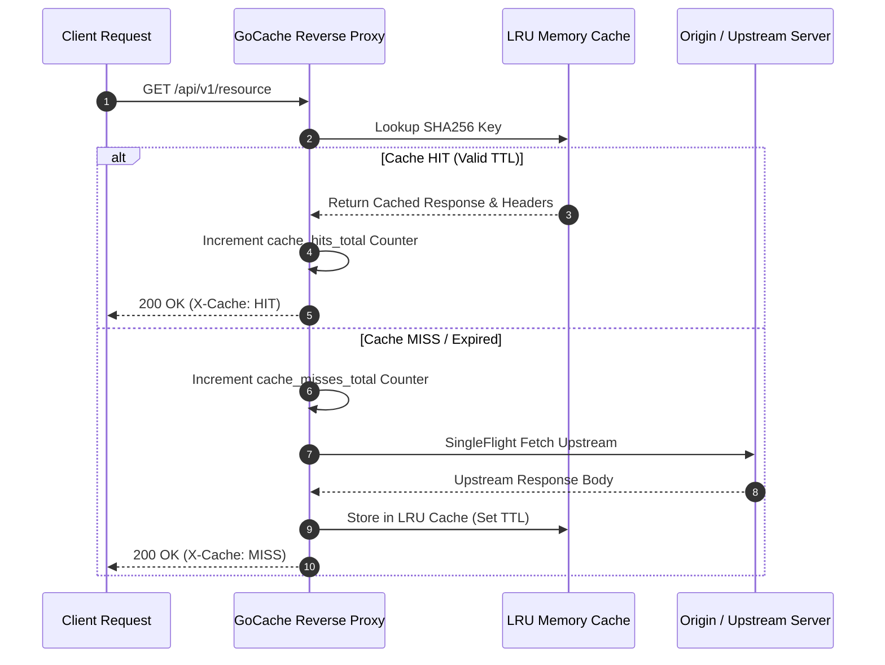

# gocache-proxy

[](https://github.com/txltedxgod/gocache-proxy/actions)
[](https://opensource.org/licenses/MIT)
[](https://golang.org/)
[](https://prometheus.io/)


> High-throughput **HTTP Caching Reverse Proxy** featuring concurrent in-memory LRU eviction, single-flight stampede protection, and native **Prometheus metrics exporter** built in **Go 1.22**.

[](https://golang.org)
[](https://prometheus.io)
[](https://github.com/txltedxgod/gocache-proxy/actions)
[](LICENSE)

`#golang` `#reverse-proxy` `#caching` `#lru-cache` `#prometheus` `#http-proxy` `#performance`

---

## 🏛️ Request Lifecycle & Cache Resolution



---

## Features

- **Concurrent LRU Cache:** Lock-striped in-memory cache with configurable item capacity and default TTL.
- **Cache-Control Header Compliance:** Parses `max-age`, `no-cache`, and `private` upstream directives.
- **Single-Flight Deduplication:** Multiple concurrent requests for the same uncached URL collapse into a single upstream request, preventing cache stampedes.
- **Prometheus Metrics:** Exposes `gocache_requests_total`, `gocache_hits_total`, and `gocache_latency_seconds` on `/metrics`.

## Quick Start

```bash
# Run reverse proxy targeting upstream API
go run cmd/proxy/main.go \
  -listen=:8080 \
  -upstream=https://api.github.com \
  -cache-size=1000 \
  -ttl=60s
```